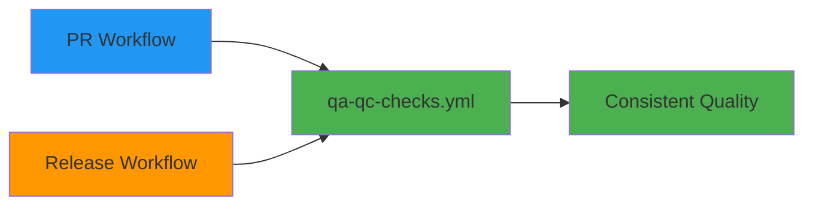

# Release Pipeline Charts & Diagrams

This directory contains visual documentation for the Statistics Canada Python package release pipeline.

## Files Overview

### Core Documentation
- **`enhanced_release_pipeline.md`** - Complete architecture overview with cross-references
- **`workflow_diagram.md`** - Interactive Mermaid flowchart with color-coding
- **`example_pr_workflow.yml`** - Example PR workflow using shared QA/QC

### Visual Elements
- 🟢 **Active** - Currently deployed and operational  
- 🟠 **Ready** - Implemented and ready for deployment
- 🔵 **Proposed** - Planned enhancement, ready for integration
- ⚪ **Legacy** - Deprecated, maintained for rollback

## Quick Navigation

### For Developers
- Want to understand the release process? → [`workflow_diagram.md`](workflow_diagram.md)
- Need architectural details? → [`enhanced_release_pipeline.md`](enhanced_release_pipeline.md)  
- Looking for workflow examples? → [`example_pr_workflow.yml`](example_pr_workflow.yml)

### For DevOps/Maintainers
- Current implementation status? → [`enhanced_release_pipeline.md#implementation-status`](enhanced_release_pipeline.md#implementation-status)
- Workflow file cross-references? → [`workflow_diagram.md#workflow-file-cross-reference`](workflow_diagram.md#workflow-file-cross-reference)
- Rollback procedures? → [`enhanced_release_pipeline.md#rollback-mechanisms`](enhanced_release_pipeline.md#rollback-mechanisms)

## Key Innovations

### 1. Smart File Filtering (🟢 ACTIVE)
Reduces unnecessary workflow runs by 60-80% through intelligent file pattern matching.

### 2. Shared QA/QC Workflow (🔵 PROPOSED)
Eliminates code duplication between PR and release workflows while maintaining consistent quality standards.

### 3. Complete Release Automation (🟠 READY)  
End-to-end automation from dev branch merge to PyPI publication with comprehensive rollback capabilities.

### 4. Color-Coded Workflow Status
Visual indication of implementation status across all pipeline components.

## Workflow Integration

## Migration Status

| Phase | Component | Status | File |
|-------|-----------|--------|------|
| 1 | Smart Changelog | ✅ ACTIVE | `dev-changelog.yml` |
| 2 | Complete Pipeline | 🟠 READY | `release-pipeline-new.yml` |  
| 3 | Shared QA/QC | 🔵 PROPOSED | `qa-qc-checks.yml` |

## Usage Instructions

### View Interactive Diagrams
1. Open any `.md` file in this directory
2. VS Code will render Mermaid diagrams with syntax highlighting
3. Use the Mermaid preview extension for interactive viewing

### Implement Shared QA/QC
1. Copy `qa-qc-checks.yml` to `.github/workflows/`
2. Update existing PR/release workflows to use shared workflow
3. Test with different `build-required` settings

### Deploy Phase 2
1. Validate Phase 1 smart changelog functionality
2. Run migration script: `./scratch/migrate_release_pipeline.sh phase2`
3. Monitor first release cycle for issues

## Related Documentation

- [`/docs/enhanced_release_pipeline_architecture.md`](../enhanced_release_pipeline_architecture.md) - Technical implementation details
- [`/scratch/migrate_release_pipeline.sh`](../../scratch/migrate_release_pipeline.sh) - Deployment automation
- [`/.github/workflows/`](../../.github/workflows/) - Actual workflow files
