# Documentation Index - Enhanced Release Pipeline

## New Files Created

### `/docs/charts/` - Visual Documentation Hub
| File | Purpose | Status |
|------|---------|--------|
| `README.md` | Navigation guide and quick reference | ✅ Complete |
| `enhanced_release_pipeline.md` | Complete architecture with cross-references | ✅ Complete |
| `workflow_diagram.md` | Interactive Mermaid flowchart with color-coding | ✅ Complete |
| `implementation_summary.md` | Current status and next steps | ✅ Complete |
| `mission_accomplished.md` | Final delivery summary | ✅ Complete |
| `example_pr_workflow.yml` | PR workflow integration example | ✅ Complete |

### `.github/workflows/` - Workflow Implementation
| File | Purpose | Status |
|------|---------|--------|
| `qa-qc-checks.yml` | Shared quality assurance workflow | 🔵 Ready for integration |
| `dev-changelog.yml` | Smart changelog (Phase 1) | 🟢 ACTIVE |
| `release-pipeline-new.yml` | Complete pipeline (Phase 2) | 🟠 READY |

## Key Features Delivered

### 1. Charts Directory Structure ✅
- Organized visual documentation hub
- Cross-referenced workflow files  
- Color-coded implementation status
- Usage examples and migration guides

### 2. Enhanced Mermaid Visualization ✅
- Interactive flowchart with file references
- Color-coded by implementation status:
  - 🟢 Active (deployed)
  - 🟠 Ready (implemented, awaiting deployment)
  - 🔵 Proposed (ready for integration)
  - ⚪ Legacy (deprecated)

### 3. Shared QA/QC Workflow ✅
- Reusable across PR and release workflows
- Configurable build requirements
- Eliminates code duplication
- Consistent quality standards

### 4. Complete Architecture Documentation ✅
- File cross-references in diagrams
- Implementation timeline and status
- Testing procedures and validation
- Rollback mechanisms and safety nets

## Usage Guide

### View Documentation
```bash
# Open main chart directory
cd docs/charts/

# View interactive diagrams (VS Code with Mermaid extension)
code workflow_diagram.md

# Quick navigation
open README.md
```

### Deploy QA/QC Workflow
```bash
# Copy shared workflow to active directory
cp docs/charts/example_pr_workflow.yml .github/workflows/pr-checks.yml

# Update existing workflows to use shared QA/QC
# Edit .github/workflows/dev-changelog.yml to include QA/QC step
```

### Test Current System
```bash
# Test smart changelog filtering
./scratch/test_release_pipeline.sh package        # Should trigger
./scratch/test_release_pipeline.sh infrastructure # Should skip

# Check migration status
./scratch/migrate_release_pipeline.sh status
```

## Visual Summary

```mermaid
graph TD
    A[📁 docs/charts/] --> B[📊 Visual Documentation]
    A --> C[🎨 Mermaid Diagrams]
    A --> D[📋 Implementation Status]
    A --> E[🔧 Usage Examples]
    
    F[⚙️ .github/workflows/] --> G[🟢 Active Workflows]
    F --> H[🟠 Ready Workflows]  
    F --> I[🔵 Proposed Workflows]
    
    B --> J[📖 Complete Architecture Guide]
    C --> K[🎯 Interactive Flow Visualization]
    D --> L[✅ Phase Status Tracking]
    E --> M[💡 Integration Templates]
    
    style A fill:#4CAF50,color:white
    style F fill:#2196F3,color:white
    style J fill:#FF9800,color:white
    style K fill:#FF9800,color:white
```



## Mission Status: ✅ COMPLETE

All requested features delivered:
- ✅ Charts directory created and organized
- ✅ Mermaid visualization enhanced with cross-references
- ✅ Color-coding by implementation status
- ✅ Shared QA/QC workflow implemented  
- ✅ Complete documentation with usage guides
- ✅ Testing frameworks and migration tools ready

Ready for Phase 1 testing and Phase 2 deployment! 🚀
