# Release Pipeline Workflow Diagram

## Interactive Workflow Visualization

This chart shows the complete release pipeline with cross-references to actual workflow files and color-coding by status.

```mermaid
flowchart TD
    %% Developer Actions
    DEV[👨‍💻 Developer Creates Feature Branch] --> PR[📝 Create PR to dev]
    
    %% PR Quality Checks (Shared QA/QC)
    PR --> QA{🔍 QA/QC Checks<br/>qa-qc-checks.yml<br/>build-required: false}
    QA -->|✅ Pass| REVIEW[👀 Code Review]
    QA -->|❌ Fail| FIX[🔧 Fix Issues]
    FIX --> QA
    
    %% PR Merge Process
    REVIEW -->|✅ Approved| MERGE[🔀 Merge to dev]
    REVIEW -->|❌ Changes Needed| FIX
    
    %% Smart Changelog (Phase 1 - ACTIVE)
    MERGE --> FILTER{📋 File Change Analysis<br/>dev-changelog.yml<br/>ACTIVE}
    FILTER -->|Package Changes<br/>statscan/, pyproject.toml, etc.| CHANGELOG[📝 Update Changelog<br/>UNRELEASED section]
    FILTER -->|Infrastructure Only<br/>.github/, docs/, tools/, etc.| SKIP[⏭️ Skip Changelog]
    
    %% Release Decision Point
    CHANGELOG --> DEPLOY_DECISION{🚀 Ready to Deploy?<br/>Manual Decision}
    SKIP --> DEPLOY_DECISION
    
    %% Complete Release Pipeline (Phase 2 - READY)
    DEPLOY_DECISION -->|Yes| RELEASE_PR[📋 Create Release PR<br/>dev → main]
    DEPLOY_DECISION -->|No| CONTINUE[⏳ Continue Development]
    
    %% Release Pipeline Stages
    RELEASE_PR --> RELEASE_QA{🔍 Release QA/QC<br/>qa-qc-checks.yml<br/>build-required: true}
    RELEASE_QA -->|✅ Pass| RELEASE_MERGE[🔀 Merge to main]
    RELEASE_QA -->|❌ Fail| RELEASE_FIX[🔧 Fix Release Issues]
    RELEASE_FIX --> RELEASE_QA
    
    %% Complete Release Pipeline (release-pipeline-new.yml)
    RELEASE_MERGE --> PIPELINE[🚀 Release Pipeline<br/>release-pipeline-new.yml<br/>READY]
    
    %% Pipeline Stages
    PIPELINE --> STAGE1[📊 Stage 1: Change Detection<br/>File Pattern Analysis<br/>Skip if infrastructure-only]
    STAGE1 --> STAGE2[🏗️ Stage 2: Build & Test<br/>Multi-Python Matrix<br/>3.11, 3.12, 3.13]
    STAGE2 --> STAGE3[📝 Stage 3: Changelog Prep<br/>Convert UNRELEASED → VERSION<br/>Extract version from wheel]
    STAGE3 --> STAGE4[📦 Stage 4: PyPI Publishing<br/>Wheel Upload & Validation<br/>Conflict detection]
    STAGE4 --> STAGE5[🏷️ Stage 5: GitHub Release<br/>Tag & Release Notes<br/>Changelog-based notes]
    
    %% Success/Failure Paths
    STAGE4 -->|❌ PyPI Fail| ROLLBACK1[🔄 Rollback Changelog<br/>Revert UNRELEASED section<br/>Preserve git history]
    STAGE5 -->|❌ GitHub Fail| ROLLBACK2[🔄 Partial Rollback<br/>PyPI Success, GitHub Fail<br/>Manual tag required]
    STAGE5 -->|✅ Success| SUCCESS[🎉 Release Complete<br/>Package Published<br/>GitHub Release Created]
    
    %% Rollback Recovery
    ROLLBACK1 --> INVESTIGATE[🔍 Investigate & Fix<br/>Check PyPI conflicts<br/>Validate credentials]
    ROLLBACK2 --> MANUAL_TAG[👨‍💻 Manual GitHub Release<br/>Create tag manually<br/>Use existing wheel]
    INVESTIGATE --> DEPLOY_DECISION
    MANUAL_TAG --> SUCCESS
    
    %% Continue Development Loop
    CONTINUE --> DEV
    SUCCESS --> DEV

    %% Styling with workflow file references
    classDef active fill:#4CAF50,stroke:#2E7D32,stroke-width:3px,color:white
    classDef ready fill:#FF9800,stroke:#E65100,stroke-width:3px,color:white
    classDef proposed fill:#2196F3,stroke:#0D47A1,stroke-width:3px,color:white
    classDef legacy fill:#9E9E9E,stroke:#424242,stroke-width:2px,color:white
    classDef success fill:#4CAF50,stroke:#2E7D32,stroke-width:2px,color:white
    classDef failure fill:#F44336,stroke:#C62828,stroke-width:2px,color:white
    classDef decision fill:#FFC107,stroke:#F57C00,stroke-width:2px,color:black
    classDef process fill:#E3F2FD,stroke:#1976D2,stroke-width:2px,color:black
    
    %% Apply Styles Based on Implementation Status
    class FILTER,CHANGELOG active
    class PIPELINE,STAGE1,STAGE2,STAGE3,STAGE4,STAGE5 ready
    class QA,RELEASE_QA proposed
    class ROLLBACK1,ROLLBACK2 failure
    class SUCCESS success
    class DEPLOY_DECISION decision
    class DEV,PR,REVIEW,MERGE,RELEASE_PR,RELEASE_MERGE process
```



## Workflow File Cross-Reference

### Active Workflows (🟢)
- **`dev-changelog.yml`** - Smart changelog with file filtering
  - **Trigger**: PR merge to dev branch
  - **Features**: Package vs infrastructure file detection
  - **Status**: Phase 1 - ACTIVE

### Ready Workflows (🟠)
- **`release-pipeline-new.yml`** - Complete 5-stage release pipeline
  - **Trigger**: Push to main branch
  - **Features**: Build, test, changelog prep, PyPI publish, GitHub release
  - **Status**: Phase 2 - READY for deployment

### Proposed Workflows (🔵)
- **`qa-qc-checks.yml`** - Shared quality assurance
  - **Type**: Reusable workflow
  - **Parameters**: `build-required` (false for PRs, true for releases)
  - **Features**: Linting, testing, optional building
  - **Status**: Implemented, ready for integration

### Legacy Workflows (⚪)
- **`dev-changelog-old.yml`** - Original changelog (backup)
- **`python-package.yml`** - Legacy build workflow
- **`publish.yml`** - Legacy publish workflow

## Key Features

### 1. File-Based Intelligence
Both changelog and release pipeline use smart file pattern matching:

**Package Files** (trigger workflows):
- `statscan/` - Main package code
- `pyproject.toml` - Package configuration
- `setup.py` - Setup configuration  
- `requirements*.txt` - Dependencies
- `README.md`, `LICENSE` - Package documentation

**Infrastructure Files** (skip workflows):
- `.github/` - Workflow definitions
- `docs/` - Documentation
- `tools/` - Development tools
- `examples/` - Usage examples
- `scratch/` - Temporary files
- `tests/*.py` - Test files

### 2. Shared QA/QC Workflow
The `qa-qc-checks.yml` workflow can be reused:

```yaml
# In PR workflow
uses: ./.github/workflows/qa-qc-checks.yml
with:
  build-required: false  # Skip build for PRs

# In release workflow  
uses: ./.github/workflows/qa-qc-checks.yml
with:
  build-required: true   # Include build for releases
```

### 3. Rollback Mechanisms
- **Changelog Rollback**: Reverts version section back to UNRELEASED
- **Partial Rollback**: Handles PyPI success but GitHub release failure
- **Investigation Path**: Returns to release decision point for retry

## Implementation Timeline

1. ✅ **Phase 1 Deployed**: Smart changelog active
2. 🔵 **QA/QC Integration**: Add shared workflow to existing pipelines  
3. 🟠 **Phase 2 Ready**: Complete release pipeline awaiting activation
4. 🔄 **Testing**: Validate all scenarios before full deployment
