# Enhanced Release Pipeline Architecture

## Overview

This document provides a comprehensive visualization of the Statistics Canada Python package release pipeline, showing the complete flow from development to production with cross-references to actual workflow files.

## Workflow Files Reference

### Active Workflows
- **`dev-changelog.yml`** - Smart Changelog Update (Phase 1 - ACTIVE)
- **`release-pipeline-new.yml`** - Complete Release Pipeline (Phase 2 - READY)

### Legacy/Backup Workflows  
- **`dev-changelog-old.yml`** - Original changelog workflow (backup)
- **`python-package.yml`** - Legacy build workflow (to be replaced)
- **`publish.yml`** - Legacy publish workflow (to be replaced)

### Proposed QA/QC Workflow
- **`qa-qc-checks.yml`** - Shared quality assurance (PROPOSED)

## Enhanced Pipeline Flowchart

```mermaid
flowchart TD
    %% Developer Actions
    DEV[👨‍💻 Developer Creates Feature Branch] --> PR[📝 Create PR to dev]
    
    %% PR Quality Checks (Shared QA/QC)
    PR --> QA{🔍 QA/QC Checks<br/>qa-qc-checks.yml}
    QA -->|✅ Pass| REVIEW[👀 Code Review]
    QA -->|❌ Fail| FIX[🔧 Fix Issues]
    FIX --> QA
    
    %% PR Merge Process
    REVIEW -->|✅ Approved| MERGE[🔀 Merge to dev]
    REVIEW -->|❌ Changes Needed| FIX
    
    %% Smart Changelog (Phase 1 - ACTIVE)
    MERGE --> FILTER{📋 File Change Analysis<br/>dev-changelog.yml}
    FILTER -->|Package Changes| CHANGELOG[📝 Update Changelog<br/>UNRELEASED section]
    FILTER -->|Infrastructure Only| SKIP[⏭️ Skip Changelog]
    
    %% Release Decision Point
    CHANGELOG --> DEPLOY_DECISION{🚀 Ready to Deploy?}
    SKIP --> DEPLOY_DECISION
    
    %% Complete Release Pipeline (Phase 2 - READY)
    DEPLOY_DECISION -->|Yes| RELEASE_PR[📋 Create Release PR<br/>dev → main]
    DEPLOY_DECISION -->|No| CONTINUE[⏳ Continue Development]
    
    %% Release Pipeline Stages
    RELEASE_PR --> RELEASE_QA{🔍 Release QA/QC<br/>qa-qc-checks.yml}
    RELEASE_QA -->|✅ Pass| RELEASE_MERGE[🔀 Merge to main]
    RELEASE_QA -->|❌ Fail| RELEASE_FIX[🔧 Fix Release Issues]
    RELEASE_FIX --> RELEASE_QA
    
    %% Complete Release Pipeline (release-pipeline-new.yml)
    RELEASE_MERGE --> PIPELINE[🚀 Release Pipeline<br/>release-pipeline-new.yml]
    
    %% Pipeline Stages
    PIPELINE --> STAGE1[📊 Stage 1: Change Detection<br/>File Pattern Analysis]
    STAGE1 --> STAGE2[🏗️ Stage 2: Build & Test<br/>Multi-Python Matrix]
    STAGE2 --> STAGE3[📝 Stage 3: Changelog Prep<br/>Convert UNRELEASED → VERSION]
    STAGE3 --> STAGE4[📦 Stage 4: PyPI Publishing<br/>Wheel Upload & Validation]
    STAGE4 --> STAGE5[🏷️ Stage 5: GitHub Release<br/>Tag & Release Notes]
    
    %% Success/Failure Paths
    STAGE4 -->|❌ PyPI Fail| ROLLBACK1[🔄 Rollback Changelog<br/>Revert to UNRELEASED]
    STAGE5 -->|❌ GitHub Fail| ROLLBACK2[🔄 Partial Rollback<br/>PyPI Success, GitHub Fail]
    STAGE5 -->|✅ Success| SUCCESS[🎉 Release Complete<br/>Package Published]
    
    %% Rollback Recovery
    ROLLBACK1 --> INVESTIGATE[🔍 Investigate & Fix]
    ROLLBACK2 --> MANUAL_TAG[👨‍💻 Manual GitHub Release]
    INVESTIGATE --> DEPLOY_DECISION
    MANUAL_TAG --> SUCCESS
    
    %% Continue Development Loop
    CONTINUE --> DEV
    SUCCESS --> DEV

    %% Styling
    classDef active fill:#4CAF50,stroke:#2E7D32,stroke-width:3px,color:white
    classDef ready fill:#FF9800,stroke:#E65100,stroke-width:3px,color:white
    classDef proposed fill:#2196F3,stroke:#0D47A1,stroke-width:3px,color:white
    classDef legacy fill:#9E9E9E,stroke:#424242,stroke-width:2px,color:white
    classDef success fill:#4CAF50,stroke:#2E7D32,stroke-width:2px,color:white
    classDef failure fill:#F44336,stroke:#C62828,stroke-width:2px,color:white
    classDef decision fill:#FFC107,stroke:#F57C00,stroke-width:2px,color:black
    classDef process fill:#E3F2FD,stroke:#1976D2,stroke-width:2px,color:black
    
    %% Apply Styles
    class FILTER,CHANGELOG active
    class PIPELINE,STAGE1,STAGE2,STAGE3,STAGE4,STAGE5 ready
    class QA,RELEASE_QA proposed
    class ROLLBACK1,ROLLBACK2 failure
    class SUCCESS success
    class DEPLOY_DECISION,RELEASE_QA decision
    class DEV,PR,REVIEW,MERGE process
```

## Workflow Cross-Reference Table

| Stage | Description | Workflow File | Status | Purpose |
|-------|-------------|---------------|--------|---------|
| PR QA/QC | Quality checks for PRs | `qa-qc-checks.yml` | 🔵 PROPOSED | Shared quality assurance |
| Smart Changelog | Intelligent changelog updates | `dev-changelog.yml` | 🟢 ACTIVE | Phase 1 enhancement |
| Release QA/QC | Quality checks for releases | `qa-qc-checks.yml` | 🔵 PROPOSED | Reused from PR checks |
| Complete Pipeline | Full release automation | `release-pipeline-new.yml` | 🟠 READY | Phase 2 enhancement |

## Color Legend

- 🟢 **Active** (Green) - Currently deployed and operational
- 🟠 **Ready** (Orange) - Implemented and ready for deployment  
- 🔵 **Proposed** (Blue) - Planned enhancement
- ⚪ **Legacy** (Gray) - Deprecated, maintained for rollback

## Key Improvements

### 1. Smart File Filtering
- **File**: `dev-changelog.yml` (ACTIVE)
- **Benefit**: 60-80% reduction in unnecessary workflow runs
- **Logic**: Package files vs. infrastructure files

### 2. Shared QA/QC Workflow (PROPOSED)
- **File**: `qa-qc-checks.yml` (to be created)
- **Benefit**: Consistent quality checks for both PRs and releases
- **Reuse**: Same checks used in multiple workflows

### 3. Complete Release Automation
- **File**: `release-pipeline-new.yml` (READY)
- **Benefit**: End-to-end automation with rollback capability
- **Stages**: 5-stage pipeline from detection to GitHub release

### 4. Rollback Mechanisms
- **Changelog Rollback**: Reverts UNRELEASED section on PyPI failure
- **Partial Rollback**: Handles PyPI success but GitHub failure
- **Manual Recovery**: Provides paths for manual intervention

## Implementation Status

### Phase 1: Smart Changelog ✅ DEPLOYED
- File filtering logic implemented
- GitHub App integration active
- Backup of original workflow created

### Phase 2: Complete Pipeline 🟠 READY
- All stages implemented and tested
- Waiting for Phase 1 validation
- Migration script ready

### Phase 3: QA/QC Workflow 🔵 PROPOSED
- Shared workflow for consistent quality checks
- Reduces duplication between PR and release workflows
- Enables build-free PR checks vs. build-required release checks

## Next Steps

1. **Test Phase 1**: Validate smart changelog with various PR types
2. **Create QA/QC Workflow**: Implement shared quality checks
3. **Deploy Phase 2**: Activate complete release pipeline
4. **Optimize**: Fine-tune based on production experience
